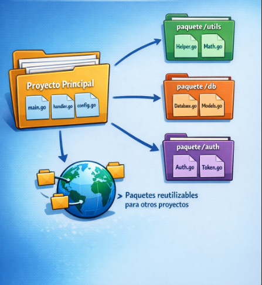

# Go Essentials

## Packages 

Cuando se trabaja en proyectos grandes y complejos, es necesario no solo devidir el codigo en varios archivos que pertenecen al mismo paquete principal, sino tambien dividir en varios paquetes que pueden servir incluso de utilitarios para otros proyectos. 

### Beneficios

* Modularidad: divide el proyecto en partes manejables
* Reutilizacion: permite utilizar el mismo codigo en diferentes proyectos
* Organizacion: facilita la localizacion y el mantenimiento de codigo
* Encapsulacion: limita la visibilidad del codigo interno del paquete

