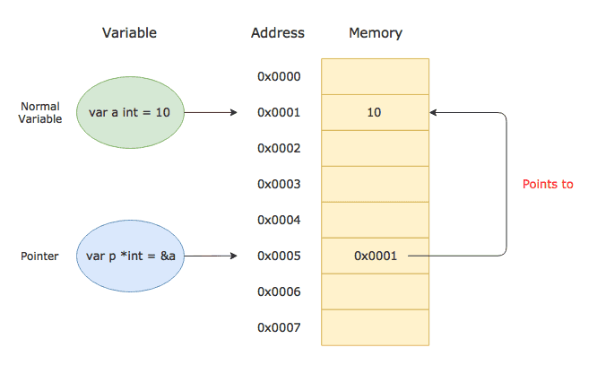

# Go Essentials

---

## Punteros

Los punteros son variables que almacenan direcciones de memoria de otras variables, no valores en si.

* El operador **&** obtiene la dirección de memoria

* El operador * se usa para desreferenciar (acceder al valor apuntado)



Ejemplo basico

```go
var x int = 42
var p *int = &x

fmt.Println(x)   // 42
fmt.Println(p)   // dirección de memoria (ej: 0xc0000120a0)
fmt.Println(*p)  // 42

```
----
 
### Ventajas de trabajar con punteros

* Evitar copias innecesarias de valores: en Go los parámetros a funciones se pasan por valor. Esto significa que, al llamar una función, Go copia el valor original de la variable. Con lo cual durante el tiempo de ejecucion de la funcion y hasta que no termine y luego pase el recolector para eliminar datos innecesarios, durante ese momento se tendra dos valores identicos en memoria. Al pasar un puntero como argumento en una funcion, no se crea ninguna copia


* Permite mutar/cambiar valores directamente: las funciones pueden recibir punteros y editar directamente sus valores lo que puede llevar menos codigo y evitar la sentencia **return** de la funcion


---